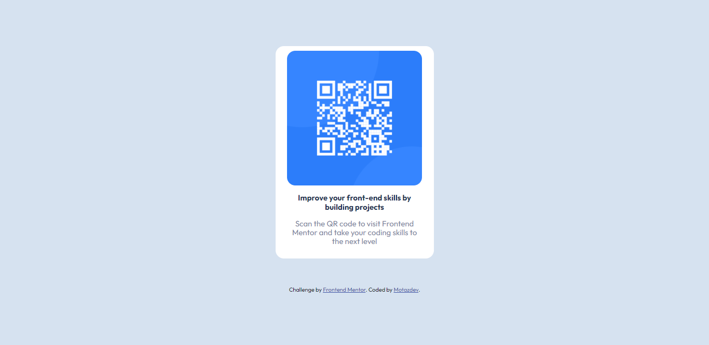

# Frontend Mentor - QR code component solution

This is a solution to the [QR code component challenge on Frontend Mentor](https://www.frontendmentor.io/challenges/qr-code-component-iux_sIO_H). Frontend Mentor challenges help you improve your coding skills by building realistic projects. 

## Table of contents

- [Overview](#overview)
  - [Screenshot](#screenshot)
  - [Links](#links)
- [My process](#my-process)
  - [Built with](#built-with)
- [Author](#author)

## Overview

### Screenshot

### Links

- Live Site URL: [Here](https://motazdev.codes/p/fe-m-qr-code-component) /  [Or Here](https://fe-m-qr-code-comp.netlify.app/)

## My process

### Built with

- Semantic HTML5 markup
- CSS custom properties
- Flexbox
- Normalize css

## Author

- Website - [motazdev](https://www.motazdev.codes)
- Frontend Mentor - [@motazdev](https://www.frontendmentor.io/profile/motazdev)

